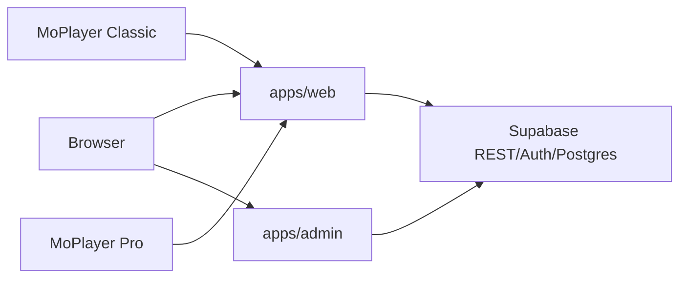

# Architecture

This monorepo contains the public website, admin control center, shared packages, Supabase migrations, and both Android apps.

## Layout

| Area | Path | Role |
| --- | --- | --- |
| Public site and app APIs | `apps/web` | Next.js on `moalfarras.space` |
| Admin control center | `apps/admin` | Next.js on `admin.moalfarras.space` |
| Optional MoPlayer dashboard | `apps/moplayer-dashboard` | Vite SPA tooling |
| Shared TypeScript | `packages/shared` | Product metadata and helpers |
| Shared database helpers | `packages/db` | Server-side DB utilities |
| Supabase schema | `supabase/migrations` | Hosted PostgreSQL migrations |
| MoPlayer Classic | `apps/moplayer-android` | Android app `com.mo.moplayer` |
| MoPlayer Pro | `apps/moplayer2-android` | Android app `com.moalfarras.moplayerpro` |

## Data Flow

`apps/web` owns public pages, APK downloads, activation APIs, release APIs, app config, support intake, diagnostics/events intake, and public rendering. `apps/admin` owns the separate admin subdomain, website CMS controls, product operations UI, releases, runtime config, activation/device/license/source workflows, support inbox, email, AI, and automation controls.

Legacy localized admin URLs on the public domain (`/en/admin/*` and `/ar/admin/*`) are not real admin surfaces anymore. They redirect to `admin.moalfarras.space` (`/website` for old CMS subpaths) so there is one operational admin.

## Source Handoff Boundary

Provider server data has a hard boundary:

1. Android creates a QR activation through `apps/web`.
2. The website can attach one Xtream/M3U source to that fresh activation.
3. Supabase holds the encrypted source only while pending.
4. The Android app fetches it once, saves it locally, and acknowledges import.
5. The web API clears the source receipt and temporary pull-token hash.

After that, browsing and playback use the Android app's local Room/shared-preference state and the provider server directly. Supabase may still provide runtime config, maintenance messages, releases, widgets, telemetry, diagnostics, and non-sensitive status receipts, but it must not become a provider/server credential store.

## Product Boundary

`packages/shared/src/app-products.ts` is the source of truth for managed product slugs.

- `moplayer` means MoPlayer Classic.
- `moplayer2` means MoPlayer Pro.

Classic activation can read legacy rows where `product_slug` is `null`. Pro activation must always use `moplayer2`.

## Shared Code

Keep shared product identity in `packages/shared`. Keep server-only database logic in `packages/db`. If ecosystem logic changes in `apps/web/src/lib/app-ecosystem.ts`, check whether `apps/admin/src/lib/app-ecosystem.ts` needs the same behavior.
