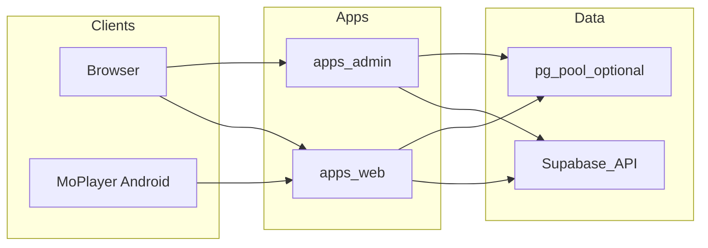

# Architecture

This document complements the main [README](../README.md). It summarizes how the monorepo is wired and where shared logic lives.

## Layout

| Area | Path | Role |
| --- | --- | --- |
| Public site + most API routes | `apps/web` | Next.js (moalfarras.space) |
| Unified control center | `apps/admin` | Next.js (admin.moalfarras.space) |
| MoPlayer Vite SPA (optional) | `apps/moplayer-dashboard` | Local / static tooling |
| Shared TypeScript | `packages/shared` | Types and small helpers (`@moalfarras/shared`) |
| Database schema | `supabase/migrations` | PostgreSQL (hosted Supabase) |
| Android — MoPlayer (production) | `apps/moplayer-android` | Gradle — `com.mo.moplayer` |
| Android — MoPlayer2 (Compose) | `apps/moplayer2-android` | Gradle — `com.moalfarras.moplayer2` |

### Related guides

See also [backend/README.md](../backend/README.md), [database/README.md](../database/README.md), [storage/README.md](../storage/README.md). Android: **`apps/moplayer-android`** (production `com.mo.moplayer`) and **`apps/moplayer2-android`** (MoPlayer2 `com.moalfarras.moplayer2`) — [android-projects.md](android-projects.md).

There is **no** separate deployable **backend app**: responsibilities are split across Next.js APIs and Supabase. The folder [`backend/`](../backend/README.md) only documents that mapping.

## Data flow

- **Supabase client** (`@supabase/supabase-js`, SSR helpers) is used for auth and table access.
- **`pg`** (see `server-db.ts` in `apps/web` and `apps/admin`) is an additional path for some server-only operations when a direct Postgres URL is configured.

## Shared code consolidation roadmap

Large modules are **duplicated** between `apps/web` and `apps/admin` (notably `app-ecosystem.ts` and `server-db.ts`), while `packages/shared` already exposes lighter types and `app-products`. This drift risk should be reduced in a dedicated change set:

1. Move **`server-db.ts`** to a workspace package (e.g. `packages/db` or under `packages/shared/server-db`) and re-export from both apps.
2. Gradually move **shared read/write helpers** from duplicated `app-ecosystem` into `packages/shared` or a new `packages/app-core`, keeping app-specific entry points thin.
3. Keep **Next.js and Supabase env wiring** in each app; only pure TS and DB helpers belong in packages.

Until that refactor lands, treat edits to ecosystem logic as **two-file edits** (web + admin) unless you verify both call paths.
