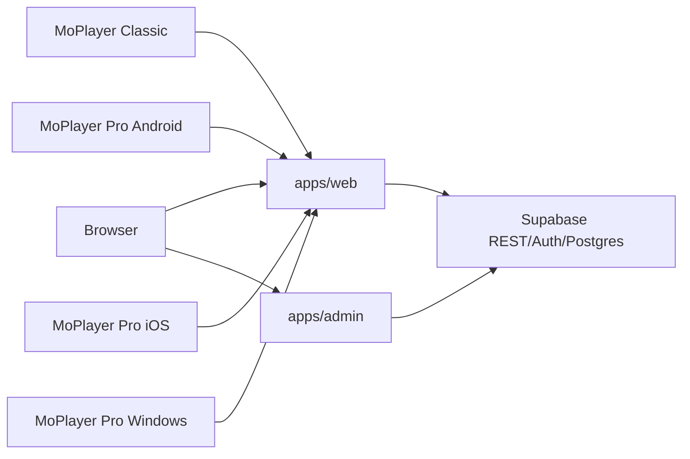

# Architecture

This monorepo contains the public website, admin control center, shared packages, Supabase migrations, Android apps, Windows client, and the MoPlayer Pro iOS Flutter app.

## Layout

| Area | Path | Role |
| --- | --- | --- |
| Public site and app APIs | `apps/web` | Next.js on `moalfarras.space` |
| Admin control center | `apps/admin` | Next.js on `admin.moalfarras.space` |
| Optional MoPlayer dashboard | `apps/moplayer-dashboard` | Vite SPA tooling |
| Shared TypeScript | `packages/shared` | Product metadata and helpers |
| Shared database helpers | `packages/db` | Server-side DB utilities |
| Supabase schema | `supabase/migrations` | Hosted PostgreSQL migrations |
| MoPlayer Classic | `apps/moplayer-android` | Android app `com.mo.moplayer` |
| MoPlayer Pro | `apps/moplayer-pro-android` | Android app `com.moalfarras.moplayerpro` |
| MoPlayer Pro Windows | `apps/moplayer-pro-windows` | Electron desktop app for `moplayer2` |
| MoPlayer Pro iOS | `apps/MoPlayer iphone ios` | Flutter iPhone app prepared for Mac/Xcode publishing |

## Data Flow

`apps/web` owns public pages, APK downloads, activation APIs, release APIs, app config, support intake, diagnostics/events intake, and public rendering. `apps/admin` owns the separate admin subdomain, website CMS controls, product operations UI, releases, runtime config, activation/device/license/source workflows, support inbox, email, AI, and automation controls.

Legacy localized admin URLs on the public domain (`/en/admin/*` and `/ar/admin/*`) are not real admin surfaces anymore. They redirect to `admin.moalfarras.space` (`/website` for old CMS subpaths) so there is one operational admin.

## Source Handoff Boundary

Provider server data has a hard boundary:

1. A MoPlayer client creates a QR activation through `apps/web`.
2. The website can attach one Xtream/M3U source to that fresh activation.
3. Supabase holds the encrypted source only while pending.
4. The app fetches it once, saves it locally, and acknowledges import.
5. The web API clears the source receipt and temporary pull-token hash.

After that, browsing and playback use the app's local secure storage/cache state and the provider server directly. Supabase may still provide runtime config, maintenance messages, releases, widgets, telemetry, diagnostics, and non-sensitive status receipts, but it must not become a permanent provider/server credential store.

## Product Boundary

`packages/shared/src/app-products.ts` is the source of truth for managed product slugs.

- `moplayer` means MoPlayer Classic.
- `moplayer2` means MoPlayer Pro.

Classic activation can read legacy rows where `product_slug` is `null`. Pro activation must always use `moplayer2`.

## Shared Code

Keep shared product identity in `packages/shared`. Keep server-only database logic in `packages/db`. If ecosystem logic changes in `apps/web/src/lib/app-ecosystem.ts`, check whether `apps/admin/src/lib/app-ecosystem.ts` needs the same behavior.

## MoPlayer iOS Architecture

MoPlayer Pro iOS is a media player client for user-provided legal sources. It does not provide content. It uses the shared product slug `moplayer2` for backend activation and app ecosystem compatibility.

| Layer | Path | Responsibility |
| --- | --- | --- |
| App shell | `apps/MoPlayer iphone ios/lib/app` | Routing, navigation rail, bootstrap, app frame |
| Features | `apps/MoPlayer iphone ios/lib/features` | Login, Home, Live, Movies, Series, Player, Search, Favorites, Settings |
| Models | `apps/MoPlayer iphone ios/lib/models` | Playlist, live channel, movie, series, episode, library records |
| Repositories | `apps/MoPlayer iphone ios/lib/repositories` | Auth/source validation, catalog access, settings, favorites/history |
| Services | `apps/MoPlayer iphone ios/lib/services` | Xtream API, M3U parser, secure storage, cache, activation, player |
| Widgets/theme | `apps/MoPlayer iphone ios/lib/widgets`, `apps/MoPlayer iphone ios/lib/core/theme` | Shared premium UI, empty/error states, glass/dark theme |

### iOS Source Flow

1. User adds an Xtream source, M3U URL, QR source, or Legal Demo source.
2. `AuthRepository` validates the source.
3. `SecureStorageService` stores source credentials locally.
4. `ActivePlaylistController` activates the selected source.
5. `ContentRepository` fetches or parses catalog data.
6. Screens read data through Riverpod providers.
7. Playback uses `media_kit` through `PlayerService`.

### iOS App Store Safety

- The app includes visible legal disclaimers.
- Legal Demo mode uses a bundled safe M3U playlist with neutral HLS sample streams.
- Settings includes source deletion, local data wipe, support, privacy, terms, and disclaimer surfaces.
- App Store metadata and screenshot guidance live in `docs/app-store`.

### iOS Build Targets

- iPhone iOS is the production target.
- Android is a Windows-side emulator preview only for local QA.
- Web and Windows are preview/debug surfaces, not App Store deliverables.
- tvOS is not marked production-ready; see `docs/apple-tv/TVOS_FEASIBILITY.md`.
